# Diagrama Entidad-Relación - App Para Brillar

```mermaid
erDiagram
    %% Entidades principales
    USUARIOS {
        int id_usuario PK
        varchar nombre
        varchar apellido
        varchar correo_electronico UK
        date fecha_nacimiento
        varchar fotografia
        int id_color_tema FK
        timestamp fecha_registro
        timestamp fecha_actualizacion
    }

    CATALOGO_COLORES_TEMAS {
        int id_color_tema PK
        varchar nombre_tema UK
        varchar nombre_display
        json colores_tema
        boolean es_activo
        timestamp fecha_creacion
    }

    CATALOGO_SENTIMIENTOS {
        int id_sentimiento PK
        varchar nombre_sentimiento UK
        varchar emoji
        text descripcion
        boolean es_activo
    }

    CATALOGO_LOGROS {
        int id_logro PK
        varchar nombre_logro
        text descripcion
        enum categoria
        varchar icono_nombre
        text mensaje_desbloqueo
        text condicion_activacion
        boolean es_premium
        boolean es_activo
        timestamp fecha_creacion
    }

    LOGROS_OBTENIDOS {
        int id_logro_obtenido PK
        int id_usuario FK
        int id_logro FK
        timestamp fecha_obtencion
    }

    CATALOGO_FRASES {
        int id_frase PK
        int id_categoria_frase
        varchar nombre_frase
        varchar autor
        varchar categoria
        boolean es_activo
        timestamp fecha_creacion
    }

    FRASES_USUARIO {
        int id_frase_usuario PK
        int id_usuario FK
        int id_frase FK
        timestamp fecha_frase
        enum estatus
        boolean es_favorito
    }

    CATALOGO_RETOS {
        int id_reto PK
        varchar nombre_reto
        text descripcion
        varchar categoria
        int duracion_dias
        boolean es_activo
        timestamp fecha_creacion
    }

    RETOS_SEMANALES {
        int id_reto_semanal PK
        int id_usuario FK
        int id_reto FK
        int dia_reto
        text nota_reto
        date fecha_inicio
        date fecha_fin
        enum estatus
        timestamp fecha_creacion
        timestamp fecha_actualizacion
    }

    DIARIO_GRATITUD {
        int id_entrada PK
        int id_usuario FK
        date fecha_escritura
        int id_sentimiento FK
        json logros
        json agradecimientos
        text mejor_parte_dia
        text aprendi_hoy
        json convirtiendo_negativo_positivo
        text pensamientos_dia
        bigint timestamp_creacion
        timestamp fecha_creacion
        timestamp fecha_actualizacion
    }

    SEGUIMIENTO_LOGROS_USUARIO {
        int id_seguimiento PK
        int id_usuario FK
        json fechas_mensaje_diario
        json frases_compartidas
        int contador_cambios_tema
        boolean diario_primera_vez_click
        boolean diario_primera_entrada
        int contador_entradas_gratitud
        boolean retos_visitados
        timestamp fecha_creacion
        timestamp fecha_actualizacion
    }

    MENSAJES_DIARIOS {
        int id_mensaje_diario PK
        int id_usuario FK
        int id_frase FK
        date fecha_asignacion
        timestamp fecha_visualizacion
    }

    CHAT_IA {
        int id_chat PK
        int id_usuario FK
        varchar id_mensaje
        enum remitente
        text contenido
        bigint timestamp
        timestamp fecha_creacion
    }

    RESUMEN_SEMANAL {
        int id_resumen PK
        int id_usuario FK
        date fecha_inicio_semana
        date fecha_fin_semana
        text resumen_generado
        json insights
        timestamp fecha_creacion
    }

    %% Relaciones principales
    USUARIOS ||--o{ LOGROS_OBTENIDOS : "obtiene"
    CATALOGO_LOGROS ||--o{ LOGROS_OBTENIDOS : "es obtenido por"

    USUARIOS ||--o{ FRASES_USUARIO : "tiene"
    CATALOGO_FRASES ||--o{ FRASES_USUARIO : "es favorita de"

    USUARIOS ||--o{ RETOS_SEMANALES : "participa en"
    CATALOGO_RETOS ||--o{ RETOS_SEMANALES : "es asignado como"

    USUARIOS ||--o{ DIARIO_GRATITUD : "escribe"
    CATALOGO_SENTIMIENTOS ||--o{ DIARIO_GRATITUD : "se siente"

    USUARIOS ||--|| SEGUIMIENTO_LOGROS_USUARIO : "tiene seguimiento"

    USUARIOS ||--o{ MENSAJES_DIARIOS : "recibe"
    CATALOGO_FRASES ||--o{ MENSAJES_DIARIOS : "es asignada como"

    USUARIOS ||--o{ CHAT_IA : "conversa"

    USUARIOS ||--o{ RESUMEN_SEMANAL : "genera"

    USUARIOS }o--|| CATALOGO_COLORES_TEMAS : "usa tema"

    %% Notas adicionales
    %% - Los campos JSON permiten flexibilidad para datos complejos
    %% - Los timestamps permiten auditoría completa
    %% - Los índices están optimizados para consultas frecuentes
    %% - Las restricciones de integridad mantienen consistencia
```

## Descripción de las Entidades:

### **Entidades Principales:**
1. **USUARIOS** - Perfil completo del usuario
2. **CATALOGO_COLORES_TEMAS** - Temas visuales disponibles
3. **CATALOGO_SENTIMIENTOS** - Estados emocionales
4. **CATALOGO_LOGROS** - Logros desbloqueables
5. **CATALOGO_FRASES** - Frases motivacionales
6. **CATALOGO_RETOS** - Retos semanales disponibles

### **Entidades de Relación:**
1. **LOGROS_OBTENIDOS** - Logros desbloqueados por usuario
2. **FRASES_USUARIO** - Frases favoritas del usuario
3. **RETOS_SEMANALES** - Retos asignados a usuarios
4. **DIARIO_GRATITUD** - Entradas del diario personal
5. **MENSAJES_DIARIOS** - Frases asignadas diariamente

### **Entidades de Seguimiento:**
1. **SEGUIMIENTO_LOGROS_USUARIO** - Tracking interno de progreso
2. **CHAT_IA** - Conversaciones con inteligencia artificial
3. **RESUMEN_SEMANAL** - Análisis semanal generado por IA

## Características del Diseño:

- **Normalización**: Evita redundancia de datos
- **Escalabilidad**: Permite crecimiento futuro
- **Integridad**: Foreign keys y restricciones apropiadas
- **Auditoría**: Timestamps en todas las entidades principales
- **Flexibilidad**: Campos JSON para datos complejos
- **Rendimiento**: Índices optimizados para consultas frecuentes 